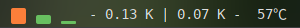

# Nano System Monitor

Show current CPU usage, memory and swap usage, net speed and CPU temperature and fan speed on panel.

Different colors represent different percentage states and CPU temperature

For best experience, please use [monospaced font](https://en.wikipedia.org/wiki/Monospaced_font), e.g. [JetBrains Mono](https://www.jetbrains.com/lp/mono/), [Source Code Pro](http://adobe-fonts.github.io/source-code-pro/), [FiraCode](https://github.com/tonsky/FiraCode), [Hack](https://github.com/source-foundry/Hack).

# Screenshot

# Installation

- from GNOME extensions: [Nano System Monitor](https://extensions.gnome.org/extension/5037/nano-system-monitor/)

# References

- [https://github.com/LGiki/gnome-shell-extension-simple-system-monitor](https://github.com/LGiki/gnome-shell-extension-simple-system-monitor)

